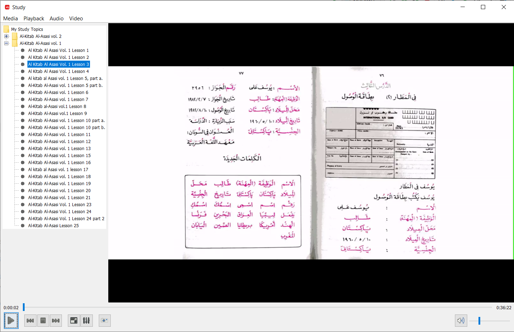

Prepare Playlist
--------
```$bash
pip install pytube
```

```
from pytube import YouTube 
from pytube import Playlist

lists = [
     ('Al-Kitab Al-Asasi vol. 1', 'https://www.youtube.com/playlist?list=PLFXGXcvbZMjJT-OFZ6WjiJEzG8vUSyXGB'),
#     ('Al-Kitab Al-Asasi vol. 2', 'https://www.youtube.com/playlist?list=PLFXGXcvbZMjIlUKfEjZfjqJ38LYdPT66s'),
#    ('Qasasun Nabiyyin Vol. 1', 'https://www.youtube.com/playlist?list=PL5xNtY-o3gWbvTPVSdopOmWA97mw3bfc0')
]

data = []

for item in lists:
    p = Playlist(item[1])

    for url in p.video_urls:
        yt = YouTube(url)

        data.append((item[0], yt.title, url))
    
import pandas as pd

df = pd.DataFrame(data, columns=['Category', 'Title', 'URL'])
df.to_csv('study-items.csv', index=False, header=None)
```

Sample output
```
Al-Kitab Al-Asasi vol. 1,Al Kitab Al Asasi Vol. 1 Lesson 1,https://www.youtube.com/watch?v=kQ0Mjg-Om94
Al-Kitab Al-Asasi vol. 1,Al Kitab Al Asasi Vol. 1 Lesson 2,https://www.youtube.com/watch?v=z18x8QvIJ5s
Al-Kitab Al-Asasi vol. 1,Al Kitab Al Asasi Vol. 1 Lesson 3,https://www.youtube.com/watch?v=GTF8aLVPASs
Al-Kitab Al-Asasi vol. 1,Al Kitab Al Asasi Vol. 1 Lesson 4,https://www.youtube.com/watch?v=9ZnyA5j9Dqs
```

Build
----------
```
mvn clean package
```
The dist package is at `./target/vlcj-player-2.0.0-SNAPSHOT-dist.zip` and `./target/vlcj-player-2.0.0-SNAPSHOT-dist.tar.gz`

Decompress to appropriate directory and execute the application. While executing the Java application, set `study.items.file` properties.
```
cp ./target/vlcj-player-2.0.0-SNAPSHOT-dist.zip /tmp

cd /tmp
unzip vlcj-player-2.0.0-SNAPSHOT-dist.zip
cd vlcj-player-2.0.0-SNAPSHOT

java -Dstudy.items.file=c:\\dev\\vlcj-player\\study-items.csv -jar vlcj-player-2.0.0-SNAPSHOT.jar
```

Screenshot
----------



License
-------

The vlcj-player project is provided under the GPL, version 3 or later.